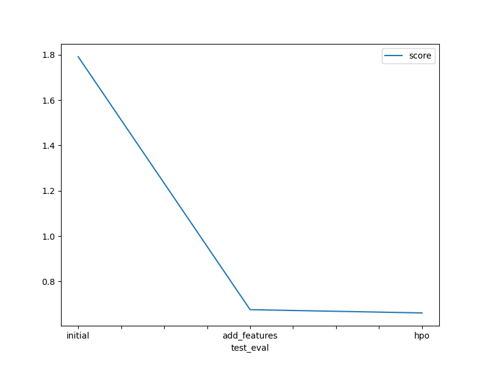

# Report: Predict Bike Sharing Demand with AutoGluon Solution
Greg Kappes

## Initial Training
### What did you realize when you tried to submit your predictions? What changes were needed to the output of the predictor to submit your results?
Any negative values would result in an error when submitting. All negative values had to be clipped to 0.

### What was the top ranked model that performed?
The top model was always a stacked ensemble model which uses a combination of all of the other models to make its prediction. This model is called `WeightedEnsemble_L3` in `autogluon` which means that it is created from three stacked layers of predictors.

## Exploratory data analysis and feature creation
### What did the exploratory analysis find and how did you add additional features?
The exploratory analysis showed that there were two features which were encoded as integers, but needed to be treated as categorical variables. Also the date could not be visualized since it was not in a numerical format. To use the date as a feature, I created three new features representing the hour, day, and month of each event in the dataset.

### How much better did your model preform after adding additional features and why do you think that is?
The error went down significantly (about 1/3 of the initial error on the test set). The data is largely seasonal and very much affected by the hour of the day. When I encoded the date into numerical values, the model was better able to take advantage of the temporal aspects of the data.

## Hyper parameter tuning
### How much better did your model preform after trying different hyper parameters?
The model's performance went up marginally when given some different hyperparameters. Probably additional feature engineering would be more effective than tweaking the hyperparamters.

### If you were given more time with this dataset, where do you think you would spend more time?
I would likely spend more time on feature engineering and trying to pull more data out of what's been given. For example, years are cyclical so potentially encoding the `month` column into two columns with sine and cosine transformations could help the model to better understand the cyclical nature of the data and potentially increase performance. It would probably also help to do a grid search of more hyperparameters, but I think that would only provide marginal increases when compared to more feature engineering.

### Create a table with the models you ran, the hyperparameters modified, and the kaggle score.

|model|	GBM|	CAT|	NN|	score|
|---|---|---|---|---|
|initial|	default|	default|	default|	1.79138|
|add_features|	default|	default|	default|	0.67576|
|hpo|	'num_boost_round': 100, 'num_leaves': 30, 'learning_rate': 5e-3|	"depth": 8, "random_strength": 1.25|	'num_epochs': 50, 'learning_rate': 5e-3, 'activation': 'relu', 'dropout_prob': 0.15|	0.66133|

### Create a line plot showing the top model score for the three (or more) training runs during the project.

### Create a line plot showing the top kaggle score for the three (or more) prediction submissions during the project.

## Summary
With the `autogluon` library, I was quickly able to arrive at a powerful baseline model that produced relatively low error with relatively little development effort. But I think that the model that was produced is really a baseline model which needs further tweaking to be deployable in production. Boosted tree-based models have a variety of hyperparameters to tweak so I think that supplying sets of hyperparameters and performing a grid or random search might also increase performance. In this first attempt at hyperparameter tuning, I simply tried out a few new values that I found sensible; for ideal results, I would perform a random search across a search space (perhaps using the bayesian method for the `NN_TORCH` params) so that I would have more likelihood to hit on some set of ideal hyperparameters. 

Most of the hyperparameters I tweaked are meant to reduce overfitting (IE reducing the number of leaves in the GBM, reducing the depth in the CATBoost, and increasing the dropout in the neural net) so I was mainly hoping to help the model generalize on the unseen test set. This seemed to work a bit since the score is better, but it's hard to tell which parameter is having the most effect. A random search like the one mentioned above would help to make sure that we find the best combination of these hyperparameters. It is also possible to train each model architecture in isolation, find the best hyperparameters, and then to collect all these findings to produce a theoretical "best" stacked model. `autogluon` also has a large variety of options for feature engineering and preprocessing which could potentially increase performance as well when tweaked.
